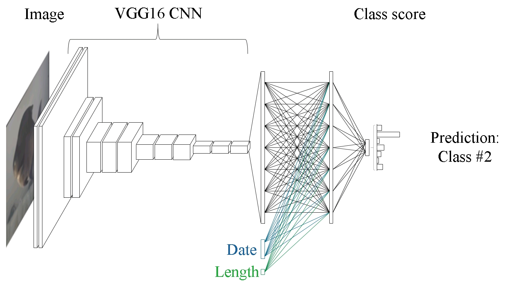
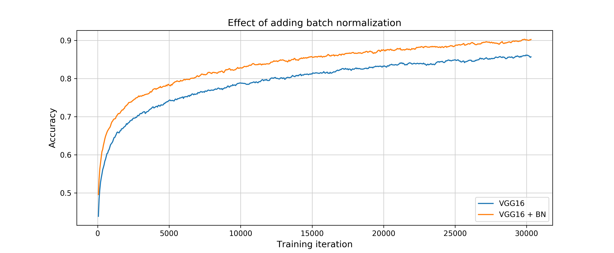

# Advances of FishNet towards a fully automatic monitoring system for fish migration

This repository is part of my [EGU 2017](http://www.egu2017.eu/) poster presentation about the current development status of the FishNet monitoring software. The poster can be found right [here](EGU2017_Poster_Kratzert_and_Mader.pdf).

## Note

This repository is not meant to give an introduction into coding nor deep learning. It should be seen more as additional information on the background of the experiments, the data and the training procedure and to give anybody who is interested the possibility to reproduce the results that were presented during the conference. I tried not to dive to much into details, but am open to any kind of questions, requests or comments (here on GitHub as Issue or per email. Contact can be found at the end of this page.)

## Structure

This repository has the following structure:

- This document gives a general overview of the study, the created dataset, the model and the procedure to train such a network.
- The `examples/` folder contains all the code, as well as further informations how you can run the model on the test set. Also a notebook is provided with that you can further analyze the classification results.
- The `data/` folder contains a subset of the entire test set, in case you don't want to download all the data but want to try some of the scripts provided in `examples/`. The download link for the entire test set can be found in the README.md of the `data/` folder.
- The `assets/` folder can be ignored, since it only contains images used in this document.
- The `eval/` folder contains the evaluation results of all 4 models (see below) on the entire test set, as well as on the subset as .csv files. They can be used if you want to have a look at different results but you don't want to evaluate the test set on your own.

## About FishNet

FishNet is the software part of the FishCam monitoring system. This system was developed at the [Institut of Water Management, Hydrology and Hydraulic Engineering](https://www.wau.boku.ac.at/en/iwhw/) at the University of Natural Resources and Life Sciences, Vienna, Austria by Helmut Mader and myself (Frederik Kratzert). The FishCam monitoring system enables contact-free observation of fish migration through underwater video observation in technical fish passes for e.g. functional monitoring. This was historically done by fish traps which mean a lot of stress for the fish, as well as time and cost consuming fieldwork.

Through FishNet, the analyses of the recorded videos can be further automatized. In it's current release state, the software can detect and track objects in the video and classify them into fish or non-fish objects. By this, the amount of data that has to be viewed manually by human experts can be reduced dramatically (~96% of recorded videos don't contain any fish). At last years EGU 2016 General Assembly I presented parts of this work. The poster can be found [here](http://www.egu.eu/awards-medals/ospp-award/2016/frederik-kratzert/).

## The goal of this study

As even watching the remaining hundreds/thousands of videos to classify the fish is a tedious work, we are currently testing the possibility to extend the automation of FishNet by computer aided fish species classification. In the area of image classification [convolutional neural networks](https://en.wikipedia.org/wiki/Convolutional_neural_network) (ConvNets) are the state-of-the-art in these days. Therefore a natural choice was to try using ConvNets for this task. But since the image quality through turbid water varies a lot and makes the classification task even more challenging, we tested the possibility to fuse additional features into the network to improve the classification accuracy.
The idea was, to use a pre-trained ConvNet ([VGG16](https://arxiv.org/pdf/1409.1556.pdf)) as feature extractor and to add additional features (e.g. length of the fish or date of the migration) into the network after the convolutional part of the network.

For this study, only two different features (namely length and date) were tested, albeit many more are possible (and will be considered in the future).

## The data

One of the most important pieces to train such a network is the amount of data available. Luckily the FishCam system is already in use for over 3 years in many different rivers in Austria, such that data availability in general was not our biggest concern.

For the purpose of this study we chose 7 different species¹ of Austrian rivers: bream, brown trout, burbot, chub, common nase, perch and rainbow trout. We chose these subset of species for the following reasons.

- We wanted to have different species of fish in the dataset, that look somehow similar to each other, to see if classification errors occur mainly between this species (e.g. rainbow trout vs brown trout or nouvelle nase vs chub).
- Additionally we wanted to have species that look clearly different (e.g. burbot, perch, bream) to investigate how good the model can separate them for the rest of the species.
- Although in total we have more data available, we chose to select only fish passes we monitored, where all fish species occur in the river system, so that there couldn't be any bias in the data related to the different appearance of the video imagery of certain fish passes (albeit the FishCam detection tunnel is a pretty normed environment).
- We wanted to have more common and more rarely seen fish in the dataset, as the situation is in rivers. The idea was to study, if it is possible to train a network also on species with more a more sparse dataset and if the network can classify them evenly compared to species with lots of data available.
- The dataset should also represent the different image qualities that occur in Austrian rivers and not only clear water examples so that we could test, how good such a system could run in operation year-round.

All fish of all the videos were in a first step classified by human experts, which serve as the ground truth data. Also available for each fish is the length, as well as the date of the recorded video. For each fish, images were extracted automatically with the FishNet software. All images are crops of the total video image that show exactly one fish. Additionally the images were rotated, such that the length-axis is horizontally. The amount of images per fish vary heavily, through different dwell times in front of the camera.

|  | bream | brown trout | burbot | chub | nase | perch | rainbow trout |
| :---: | :---: | :---: | :---: | :---: | :---: | :---: | :---: |
| #fish | 1122 | 461 | 281 | 1130 | 639 | 377 | 1050 |
| #imgs | 7800 | 4351 | 1812 | 8783 | 5839 | 2686 | 6859 |

This dataset was then randomly split to create one dataset for the training process and one for testing the model after training. The split was made separately for each species to make sure we have the same ratio for all species. The split was performed on the fish individuals, not the images, to make sure there is none image of one fish out of one video in the test set and the training set. In total 80 % of all fish (and their related images) were chosen for training and remaining 20 % (with their images) was selected as the test set.

¹ **NOTE**: In the abstract I wrote about 6 species, but later we chose to add one more specie.

## The model

The core of the model consists of the [VGG16 model](https://arxiv.org/pdf/1409.1556.pdf). Until the first dense layer the model stayed untouched and was initialized with the pre-trained weights from the original VGG16 trained on the [ImageNet-Dataset](http://image-net.org/). After this, some adaptations were made to the original model.

- After each fully connected layer a [batch normalization](https://arxiv.org/abs/1502.03167) layer was introduced, as they proved to help to train the model and to improve the accuracy (see image below)
- I added the possibility to fuse additional data (as vectors) to the first fully connected layer. In the case of the length, the input is first passed through a separate batch normalization layer to normalize the input in a learnable fashion.

To bring date-like features into a neural network the date has to be changed into a format usable for neural networks. Different approaches are possible, but for this study I have chosen to only use the information in which week of the year the video was recorded and to convert this information into a one-hot encoding. This means the date is transformed into a vector of size (52,) where each value is zero except the `i-th`, which is one, with `i` staying for the `i-th` week of the year.  

Using two additional features, this 4 different models were tested for this study:
- VGG16: Classification based only on the images
- VGG16 + length: Classification based on images and the length of the fish
- VGG16 + date: Classification based on the images and the week-vector
- VGG16 + both: Classification based on the images as well as length and the week-vector

## The training procedure

As this is a highly unbalanced classification problem, I had to take care on how to train the networks. There are different approaches on how to tackle this problem (e.g. class weights during training, balanced batches). For neural networks in general it's wisely to chose balanced batches over class weights. This means, that you have to generate batches of training images in which each species is similarly represented. This implies that the network will see images of underrepresented species more often during training.

To tackle the problem of overfitting I made use of [data augmentation](https://en.wikipedia.org/wiki/Convolutional_neural_network#Artificial_data) during the training process. Data augmentation means, that you artificially enlarged the training data by applying random transformations on the training images (such as small shifts in brightness, saturation, hue, contrast and random horizontal flips). Data augmentation was also performed on the length feature, were random values in the range of [-20 : 20] mm were added to the real value. This was done, because a) The measured values rounded by the human expert in even categories (such as 150 mm, 160 mm, 170 mm etc..) and b) the precision of the measurement out of the video by humans has shown to have an uncertainty range of approximately +- 3 cm.

All networks were trained for 40 epochs with a batch size of 35 (5 images per species). Normally one epoch means that the network has seen each image of the training set once. As we have uneven numbers of images between the classes one epoch signifies here, that the network has seen each image of the species with the highest number once. The highest number of images per species was 7580 for chub(note: the split was on 80 % of the fish individuals, not the images!). Therefore you have 7580 / 5 = 1516 iterations per epoch.

Also note, that during the training the network does not know about the fact, that the dataset consists of different fish individuals with a varying number of images per fish. The loss during the training process is calculate per-image-wise, which means the network tries to predict each image correctly and not a fish as a sum of many images.

## Evaluation

During evaluation a more realistic approach was chosen. Because the main interest is to classify each fish individual correctly the predictions of all images for one fish were combined and one single prediction was made per individual. Two different approaches were studied to combine the predictions.

1. **Mode**: For each image, the class with the highest probability was chosen as the prediction. Then the mode of the predicted labels of all images for one fish was chosen as the overall prediction for the individual.

2. **Max-Prob:** The class probabilities for each class of all images were summed and the final prediction was the class with the highest overall probability

## Results

The table below shows the results for the 4 different model variation that were tested: image-only (VGG16), image + length (VGG16 + length), image + date (VGG16 + date) and image + length + date (VGG16 + all). Besides the per-fish accuracy scores derived from the two approaches `mode` and `max-prob` also the per image accuracy is listed.

|   | per image | mode | max-prob |
| :--- |:---: |:---: |:---: |
| VGG16 | 82.0 % | 87.5 % | 87.7 % |
| VGG16 + length | 83.1 % | 88.3 % | 89.0 % |
| VGG16 + date | 86.2 % | 90.2 % | 90.3 % |
| VGG16 + all | 87.1 % | 91.2 % | 91.7 % |

 We can see, that combining the predictions of many images for one fish can be done best by the `max-prob` method, as this yields the best results for all models. Also we can see, that fusing additional features into the network helps to achieve better classification accuracies in general.

**Note**: These numbers are derived by evaluating the entire test set. The numbers for the sample test set may vary as they are a random subset of 10 % for each fish species.

In the notebook `examples/explorer.ipynb` you can further analyze the results.

## Conclusion

In this study I tested the possibility to include automatic fish species classification within the FishCam monitoring System. For this task a new dataset was created, covering seven different fish species of Austrian rivers. Each fish-sample in the dataset consists of a varying number of images and additional features (length and the time of migration). The core of the classification model is a fine-tuned convolutional neural network, were the deeper layers were adapted, so that it is possible to fuse the additional features into the network.

The results of the study show that
- additional feature help improving the classification accuracy of the network
- combining the classification results of all images of one fish by the _max prob_ method works best.
- the highest accuracy of 91.7 % could be achieved by combining images with both additional features

These are promising results, although this study only considered a subset of all fish in Austrian river and the dataset (samples per species) could have been higher. Therefore the next logical step should be to increase the sample size per species, gather data of additional species and maybe find additional features that could help to further improve the classification accuracy.

## Contact

If you have any additional question about this study or the FishCam monitoring system itself, please feel free to contact me.

Frederik Kratzert - frederik.kratzert(at)boku.ac.at  
Institute of Water Management, Hydrology and Hydraulic Engineering (IWHW)  
University of Natural Resources and Life Sciences, Vienna  
Muthgasse 18  
1190 Vienna, Austria
